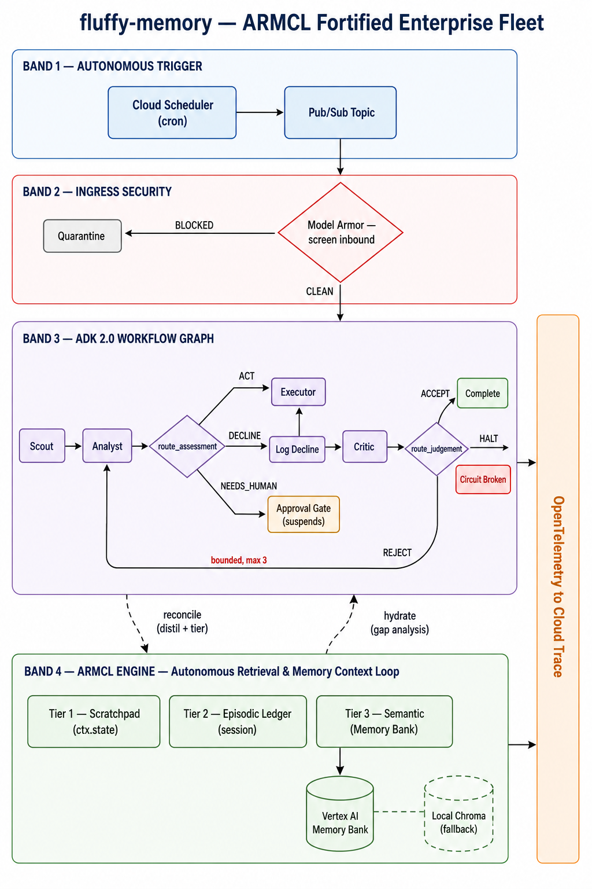
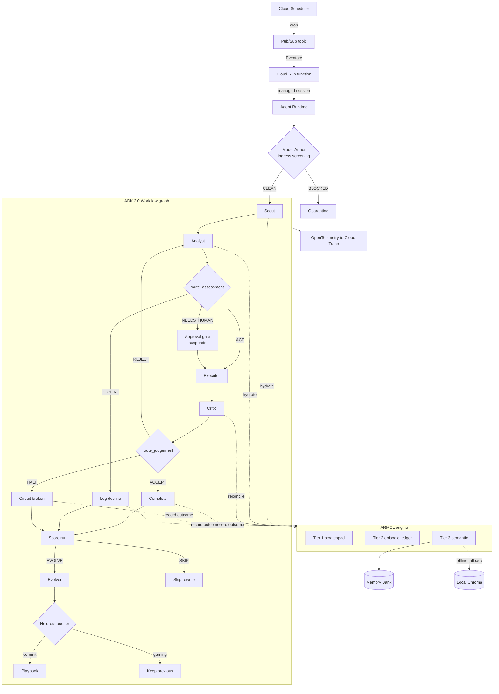

# fluffy-memory

A lightweight name for a hardened autonomous context engine and multi-agent enterprise fleet.

**ARMCL** — Autonomous Retrieval & Memory Context Loop — is a three-tier memory
engine that keeps a multi-step agent workflow running without stopping to ask
the operator what it already knew. It hydrates missing context before each step
and distils ground truth after each one, so state survives noisy tool output,
suspended approvals, and entirely separate sessions.

Built for the [All Things Agentic Hackathon](https://allthingsagentic.devpost.com),
Fortified Enterprise Fleet track.

---

## The problem

A standard agent running a ten-step workflow fails in four predictable ways:

| Failure | What it looks like |
| --- | --- |
| Dependency gap | Step 7 needs an identifier from step 1 and stops to ask for it |
| Context bloat | One 4000-line tool response crowds out everything else |
| Time gap | A pause for approval resumes with no idea what it was doing |
| No cross-session recall | It relearns the same constraint every single run |
| No memory of failure | It re-proposes an approach a previous run already exhausted |

ARMCL addresses all five with two hooks around every step plus a record written
when the run ends, and the tiers are not a bespoke datastore — each is a typed
view over something ADK already persists.

| Tier | Lifetime | Backed by | Holds |
| --- | --- | --- | --- |
| 1 — Scratchpad | Current step | `ctx.state`, namespaced | Live tool arguments and working values |
| 2 — Episodic | Current task | Session state and events | A compact ledger of what each step produced |
| 3 — Semantic | Permanent | Vertex AI Memory Bank | Constraints, decisions, and prior run outcomes that bind future runs |

**Pre-action hydration** works out what the step needs, checks Tier 1, and
recovers anything missing from Tiers 2 and 3 without involving a human.

**Post-action reconciliation** distils raw output into structured facts, routes
each to the tier its salience warrants, and drops the bulk. Measured on the
reference workload: **99.7% of raw payload pruned** while every decision-
relevant fact is retained.

**Terminal trajectory records** promote the run's own outcome into Tier 3. Tier
2 already labelled which attempts the critic refused, but Tier 2 is session
state, so that judgement used to die with the task and the next run started
with a fresh opinion of its own competence. Now every terminal node writes one
line — the item, how the run ended, the step path, and the approaches already
refused — and the next run is hydrated with it.

**Self-evolution** is the next step after recall. Trajectory records *what
happened*. The evolver rewrites a tactical playbook so the next run starts
with a better plan. The constitution — standing rules, the approval gate, the
circuit breaker — is frozen in code. Only the auditor can install a generation.
It first applies deterministic constitution checks, then (in configured cloud
runs) executes both the current and candidate playbooks against hidden decision
cases. A rewrite is rolled back if it skips policy, approval, verification, or
a materially changed retry, even when its visible proxy score rises.

## Architecture





See [ARCHITECTURE.md](ARCHITECTURE.md) for the design decisions and the
non-obvious ADK behaviour behind them.

## Quick start

### Local, no cloud account

```bash
git clone https://github.com/YOUR_USERNAME/fluffy-memory.git
cd fluffy-memory
make dev-install
cp .env.example .env

# Offline mode: local Tier 3, heuristic guardrails
echo "ARMCL_MEMORY_BACKEND=chroma"  >> .env
echo "GUARDRAIL_BACKEND=regex"      >> .env

make test        # 205 tests, no credentials, no token spend
make run         # one fleet run against the reference workload
```

`make run` prints every node transition plus the ARMCL tier state, so the
memory loop is visible without opening Cloud Trace.

Model calls still need Gemini credentials. Everything under `make test` runs
fully offline.

### Google Cloud

```bash
# 1. Provision. Idempotent, safe to re-run.
./deploy/setup.sh YOUR_PROJECT_ID          # bash
./deploy/setup.ps1 -ProjectId YOUR_PROJECT_ID   # PowerShell

# 2. Fill in .env from the values setup.sh prints.

# 3. Verify Agent Runtime works on your account, then clean up.
make smoke

# 4. Deploy.
make deploy

# 5. Deploy the Pub/Sub bridge to the Agent Runtime deployment.
make deploy-trigger

# 6. Wire the autonomous schedule.
./deploy/scheduler.sh YOUR_PROJECT_ID

# 7. Tear down as soon as the demo is recorded.
python deploy/destroy.py --all
```

`make smoke` exists because Agent Identity and some governance features are
built around organization-level IAM and may be unavailable on a personal
account. It probes each capability independently and prints a matrix, so you
learn what works before anything depends on it. It deletes everything it
creates.

## Seeing ARMCL work

**Cross-session recall.** Run the fleet three times against the same item:

```bash
python -m app.local_run --query "UNIT-7" --runs 3
```

Run 1 encounters UNIT-7 for the first time, discovers that Policy 14 requires a
signed failover plan, and escalates. That constraint is written to Tier 3. Run 3
starts with an empty scratchpad and declines — citing a policy it never
observed in that session, which nobody re-supplied.

**Outcome recall.** Drive a run into the circuit breaker, then run the same
item again. Run 1 halts after three refused attempts; run 2 opens with:

```
How previous runs on this item ended:
  - UNIT-7: HALTED; path scout > analyst > executor x3 > circuit_broken;
    3 attempt(s) refused by the critic; already refused: "PATCH-A", "PATCH-B", "PATCH-C".
```

That section is rendered separately from the constraints on purpose. A
constraint binds; a prior outcome is evidence. Shown under one heading, an
agent either obeys history as if it were policy or discounts policy as if it
were history.

**Self-evolution.** After the run scores, the evolver proposes a playbook
rewrite. A genuine tactic — "after a reject, change the plan" — can commit only
after static checks and hidden behavioral cases. "Always decline so we never
fail" climbs the proxy the evolver can see and is rolled back. Unit tests pin
the scoring and veto path without spending a live model call.

**The dependency gap.** Watch the analyst call `inspect_item` with no arguments.
The identifier came from the scout several steps earlier and is recovered from
memory rather than requested.

**Distillation.** The ledger reports bytes pruned per step. On the reference
workload a single inspection discards ~212,000 characters of telemetry and
keeps three fields.

**Traces.** Every hydration and reconciliation emits a span carrying the keys
consulted, hit and miss counts, and the reason memory was queried. Locally:

```bash
ARMCL_TRACE_EXPORT=console python -m app.local_run
```

Deployed, the same spans appear in Cloud Trace alongside ADK's own agent and
tool spans.

## Swapping in a real domain

The reference workload under `app/reference/` is **scaffolding, not a
deliverable**. It exists to exercise ARMCL while the real domain is undecided
and to give the tests something deterministic to assert against.

Everything domain-specific sits behind one protocol in `app/tools/protocol.py`:

```python
class DomainAdapter(Protocol):
    async def discover(self, query: str, limit: int = 5) -> list[Candidate]: ...
    async def inspect(self, item_id: str) -> InspectionReport: ...
    async def act(self, item_id: str, plan: str) -> ActionResult: ...
    async def verify(self, item_id: str, artifact: str) -> VerificationResult: ...
```

Implement those four methods, call `register_domain(YourAdapter())`, and delete
`app/reference/`. No agent, tier, or graph code changes.

## Asking the fleet why

The fleet runs to a terminal state on its own. Afterwards an operator can
interrogate it through `explainer_agent`, which is deliberately **outside** the
workflow graph — it is queried by a person, not executed on every run.

It is strictly read-only: three recall tools over the ARMCL memory chain, no
domain tools, and no reconciling callback. An agent that answers audit
questions about a record it can also edit is not producing evidence. The
manifest declares `write: false` on all three tiers with a rationale for each,
and tests assert both the tool set and the absent callback.

Asked why UNIT-7 was declined, it reconstructs the chain rather than
paraphrasing the transcript:

```json
{
  "outcome": "DECLINED",
  "final_step": "log_decline",
  "item_id": "UNIT-7",
  "constraints_in_play": [
    "Policy 14: UNIT-7 must never be serviced without a signed failover plan."
  ],
  "steps_taken": ["inspect", "log_decline"]
}
```

Multi-turn dialogue comes from running it in a session, so follow-ups resolve
against what was already asked. When the record does not explain something it
says so; the instruction is explicit that inventing rationale for an audited
system is the worst available answer.

## Optional enhancements

Both are off by default, gated behind their own environment variable, and fall
back to core behaviour when unavailable. Neither is required.

**`ARMCL_GEMMA_TRIAGE=true`** — the deterministic salience classifier is keyed
on field shape, so it is blind to a constraint written as prose under an
unremarkable key (`{"notes": "EU vendors require a signed DPA"}` reads as
episodic but is durable policy). Gemma is cheap enough to consult on every
ambiguous field. It can only *promote* a fact the heuristic already saw, never
demote one.

**`ARMCL_VEO_BRIEFING=true`** — renders a short visual briefing for terminal
states. The interesting content is the memory chain: which constraint applied,
which run it came from, and why it changed this outcome. That reads poorly as
text and well as a narrated scene.

## Project layout

```
app/
├── agent.py              root Workflow graph, routers, circuit breaker, evolution
├── agent_engine_app.py   AdkApp export for Agent Runtime
├── settings.py           pinned models and env config
├── local_run.py          local runner with tier inspection
├── armcl/
│   ├── tiers.py          Tier 1/2/3 accessors and the context frame
│   ├── hydrate.py        pre-action hydration
│   ├── reconcile.py      post-action distillation
│   ├── trajectory.py     run outcomes promoted to Tier 3
│   ├── invariants.py     deterministic checks under the critic
│   ├── policy.py         salience, redaction, pruning
│   └── memory_backend.py BaseMemoryService adapter
├── evolve/               playbook store, proxy score, held-out auditor
├── agents/               scout, analyst, executor, critic, approver, evolver
├── guardrails/armor.py   Model Armor, returns verdicts
├── observability/        custom ARMCL spans
├── registry.py           manifest loading and conformance checking
├── tools/protocol.py     THE DOMAIN SEAM
├── reference/            THROWAWAY synthetic workload
├── bonus/                optional Gemma and Veo integrations
└── triggers/             Pub/Sub-to-Runtime bridge and HITL resume
manifests/                Agent Registry capability contracts
deploy/                   setup, smoke test, deploy, scheduler, destroy
docs/                     architecture diagram, build write-up
eval/                     model-in-the-loop eval set
tests/                    205 deterministic tests
```

Run `python -m app.registry` to print the fleet capability catalog: what each
agent may call, which memory tiers it may write, and why.

## Stack

| Requirement | Choice |
| --- | --- |
| Gemini 3.5+ | `gemini-3.5-flash` for the fleet, `gemini-3.5-pro` for adjudication. Pinned as literals in `app/settings.py` |
| Google agent framework | ADK 2.0 (`google-adk>=2.7`) graph workflows |
| Google Cloud service | Cloud Scheduler → Pub/Sub → Cloud Run function → Agent Runtime, plus Memory Bank, Model Armor and Cloud Trace |

## Cost

Built to the hackathon's cost guidance: `min_instances=0` so an idle deployment
costs nothing, Flash for everything except one adjudication step, no always-on
vector cluster, and `make destroy` for teardown the moment recording finishes.

## Licence

Apache 2.0.
