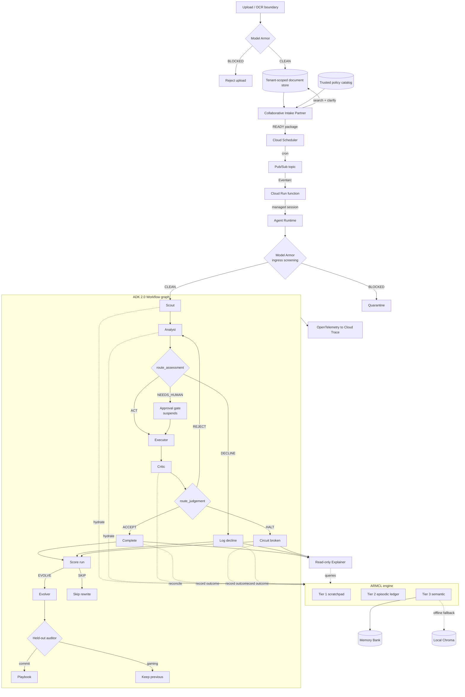

# fluffy-memory

A policy-governed multi-agent system for finding and pursuing opportunities a
person is demonstrably qualified for. It supports jobs, internships,
fellowships, scholarships, grants, research programs, accelerators,
mentorships, contracts, training, volunteer roles, and internal mobility
through one provider and workflow seam.

The system guides secure evidence intake, builds a grounded candidate profile,
finds and ranks clear matches, creates truthful application materials, pauses
before external submission unless prior authority explicitly permits it,
submits idempotently through an authorized provider, verifies the receipt, and
tracks the opportunity pipeline.

At its core is **ARMCL — Autonomous Retrieval and Memory Context Loop**, a
three-tier context engine that preserves identifiers, policies, failed
attempts, and approvals across noisy tool output, process restarts, and cold
sessions.

Built for the [All Things Agentic Hackathon](https://allthingsagentic.devpost.com),
Fortified Enterprise Fleet track. The fleet also embeds Taskmaster-style
autonomous execution and a Collaborative Partner interface:

```text
Fortified Enterprise Fleet
├── Collaborative Partners: prepare evidence, preferences, matches, and materials
├── Taskmaster workflow: recommends, prepares, submits, verifies, and tracks
└── Enterprise controls: policy, memory, approval, audit, and security
```

> An autonomous opportunity-operations fleet that moves from secure evidence
> intake to qualified discovery, tailored materials, approved action, verified
> submission, and continuing pipeline management—without fabricating claims or
> weakening mandatory requirements.

---

## What the system does

```text
Applicant or intake coordinator
        │
        ▼
Collaborative Intake + Opportunity Partners
  ├─ validates screened uploads
  ├─ identifies missing evidence
  ├─ searches only this tenant and application
  ├─ asks targeted clarification questions
  ├─ builds an evidence-grounded candidate profile
  ├─ finds and explains clearly qualified matches
  ├─ creates truthful, tailored application documents
  └─ prepares an authorized fleet handoff
        │
        ▼
Fortified Autonomous Fleet
  ├─ discovers and inspects the opportunity case
  ├─ checks mandatory requirements and evidence
  ├─ decides ACT / DECLINE / NEEDS_HUMAN
  ├─ obtains approval when required
  ├─ recommends, prepares, or submits idempotently
  └─ independently verifies the artifact or receipt
        │
        ▼
Completed / Declined / Denied / Quarantined / Safely halted
        │
        ▼
Read-only explanation and governed tactical evolution
```

The durable artifact depends on the selected mode: a recommendation record,
application package, or provider submission receipt. Completing, routing, and
verifying the entire case is the Taskmaster outcome; the system is not merely
a search-results page or document-writing chatbot.

## The problem

People and the institutions supporting them—career centers, workforce
programs, universities, research offices, and internal-talent teams—face
fragmented opportunity sources, repetitive applications, unclear
requirements, and little evidence that a recommendation is genuinely
qualified. The failure modes extend beyond model accuracy:

| Failure | Institutional consequence |
| --- | --- |
| Dependency gap | A later step loses the application ID and asks for known information |
| Context bloat | Multi-page documents crowd policy and decision evidence out of context |
| Requirement drift | Preferred qualifications become mandatory, or hard rules are weakened |
| Unsafe documents | Prompt injection or tool-poisoning text enters a model boundary |
| Time gap | A suspended approval resumes without its plan or subject |
| Duplicate effects | A crash or redelivery creates a second external submission |
| No cross-session recall | The fleet repeatedly relearns an organizational constraint |
| No memory of failure | A rejected artifact or application plan is proposed again |
| Weak auditability | A reviewer cannot reconstruct why an outcome occurred |

ARMCL addresses these failures with two hooks around every step plus a record written
when the run ends, and the tiers are not a bespoke datastore — each is a typed
view over something ADK already persists.

| Tier | Lifetime | Backed by | Holds |
| --- | --- | --- | --- |
| 1 — Scratchpad | Current step | `ctx.state`, namespaced | Live tool arguments and working values |
| 2 — Episodic | Current task | Session state and events | A compact ledger of what each step produced |
| 3 — Semantic | Permanent | Vertex AI Memory Bank | Constraints, decisions, and prior run outcomes that bind future runs |

**Pre-action hydration** works out what the step needs, checks Tier 1, and
recovers anything missing from Tiers 2 and 3 without involving a human.

**Post-action reconciliation** distils tool output into structured facts and
routes each to the tier its salience warrants. Multi-page career and project
evidence stays behind the screened adapter boundary while verified claims,
requirements, citations, identifiers, artifacts, and receipts remain available.

**Terminal trajectory records** promote the run's own outcome into Tier 3. Tier
2 already labelled which attempts the critic refused, but Tier 2 is session
state, so that judgement used to die with the task and the next run started
with a fresh opinion of its own competence. Now every terminal node writes one
line — the item, how the run ended, the step path, and the approaches already
refused — and the next run is hydrated with it.

**Self-evolution** is the next step after recall. Trajectory records *what
happened*. The evolver rewrites a tactical playbook so the next run starts
with a better plan. The constitution — standing rules, the approval gate, the
circuit breaker — is frozen in code. Only the auditor can install a generation.
It first applies deterministic constitution checks, then (in configured cloud
runs) executes both the current and candidate playbooks against hidden decision
cases. A rewrite is rolled back if it skips policy, approval, verification, or
a materially changed retry, even when its visible proxy score rises.

## Architecture




See [ARCHITECTURE.md](ARCHITECTURE.md) for the design decisions and the
non-obvious ADK behaviour behind them.

## Agent fleet

The project separates responsibilities instead of giving one agent unrestricted
tools and memory access:

| Agent | Responsibility | Important boundary |
| --- | --- | --- |
| Collaborative Intake Partner | Guides uploads, searches evidence, asks clarification, prepares handoff | Cannot decide eligibility or write policy |
| Collaborative Opportunity Partner | Builds grounded profiles, finds clear matches, creates materials, tracks progress | Has no submission tool |
| Scout | Discovers opportunity cases and surfaces recalled constraints | Cannot amend Tier 3 |
| Analyst | Applies evidence and policy; returns `ACT`, `DECLINE`, or `NEEDS_HUMAN` | Structured route schema |
| Approver | Suspends and resumes the run for human sign-off | Anything except explicit approval fails safe |
| Executor | Records a recommendation, package, or provider submission | Idempotent side-effect boundary |
| Critic | Independently verifies the artifact or receipt | Can reject; deterministic invariants can veto acceptance |
| Evolver | Proposes better operational tactics after a run | Cannot install or grade its own rewrite |
| Explainer | Reconstructs why an outcome occurred | Read-only across all memory tiers |

Every agent has a versioned manifest under `manifests/` declaring its model,
capabilities, tools, memory scopes, guardrails, and failure policy. Registry
conformance tests fail if the running fleet drifts from those contracts.

## Security, governance, and reliability

**Screen before reasoning.** Initial requests and extracted uploads cross Model
Armor before agent use. Inbound screening fails closed. The local regex backend
is labeled as a heuristic and never presented as Model Armor.

**Separate evidence from requirements and policy.** Applicant documents are
application-scoped evidence. Opportunity requirements come from an authorized
provider; institutional rules come from the versioned read-only policy catalog.
Applicant content cannot rewrite either source.

**Minimize data on write.** Credentials, private-key markers, email addresses,
SSNs, card-like values, phone numbers, and dates of birth are redacted at the
relevant state or citation boundary. Bulk raw documents remain behind the
screened adapter rather than entering ARMCL context.

**Isolate tenants and applications.** Document listing and search require both
an authenticated tenant scope and an opaque application ID. Tests verify that
another tenant's evidence cannot appear in retrieval results.

**Bound model behavior deterministically.** The system combines stable
idempotency keys, pre-execution checkpoints, rollback, rejected-artifact
detection, structural invariants, exponential retries, a circuit breaker, and
fail-safe approval routing. A model may recommend; it cannot remove these
controls.

**Preserve an audit chain.** Tier 2 records every reconciled step and its final
outcome. Terminal trajectories promote compact outcomes into Tier 3, and the
Explainer reconstructs decisions without being able to edit their evidence.

## Quick start

### Local, no cloud account

```bash
git clone https://github.com/YOUR_USERNAME/fluffy-memory.git
cd fluffy-memory
make dev-install
cp .env.example .env

# Offline mode: local Tier 3, heuristic guardrails
echo "ARMCL_MEMORY_BACKEND=chroma"  >> .env
echo "GUARDRAIL_BACKEND=regex"      >> .env

make test        # 238 tests, no credentials, no token spend
make run         # seeded recommendation run across opportunity categories

# Other bounded operating modes
python -m app.local_run --opportunity-mode prepare
python -m app.local_run --opportunity-mode approve_to_submit
```

`make run` prints every node transition plus the ARMCL tier state, so the
memory loop is visible without opening Cloud Trace.

Model calls still need Gemini credentials. Everything under `make test` runs
fully offline.

### Google Cloud

```bash
# 1. Provision. Idempotent, safe to re-run.
./deploy/setup.sh YOUR_PROJECT_ID          # bash
./deploy/setup.ps1 -ProjectId YOUR_PROJECT_ID   # PowerShell

# 2. Fill in .env from the values setup.sh prints.

# 3. Verify Agent Runtime works on your account, then clean up.
make smoke

# 4. Deploy.
make deploy

# 5. Deploy the Pub/Sub bridge to the Agent Runtime deployment.
make deploy-trigger

# 6. Wire the autonomous schedule.
./deploy/scheduler.sh YOUR_PROJECT_ID

# 7. Tear down as soon as the demo is recorded.
python deploy/destroy.py --all
```

`make smoke` exists because Agent Identity and some governance features are
built around organization-level IAM and may be unavailable on a personal
account. It probes each capability independently and prints a matrix, so you
learn what works before anything depends on it. It deletes everything it
creates.

## Seeing ARMCL work

**Cross-session recall.** Run the seeded opportunity search three times:

```bash
python -m app.local_run --runs 3
```

Run 1 discovers clearly qualified opportunities and stores item-scoped
mandatory requirements and terminal outcomes in Tier 3. Later cold sessions
surface the relevant constraint and prior run outcome without replaying the
original transcript.

**Outcome recall.** Drive a run into the circuit breaker, then run the same
item again. Run 1 halts after three refused attempts; run 2 opens with:

```
How previous runs on this item ended:
  - CASE-...: COMPLETED; path scout > analyst > executor > critic > complete;
    verified recommendation, package, or provider receipt recorded.
```

That section is rendered separately from the constraints on purpose. A
constraint binds; a prior outcome is evidence. Shown under one heading, an
agent either obeys history as if it were policy or discounts policy as if it
were history.

**Self-evolution.** After the run scores, the evolver proposes a playbook
rewrite. A genuine tactic — "after a reject, change the plan" — can commit only
after static checks and hidden behavioral cases. "Always decline so we never
fail" climbs the proxy the evolver can see and is rolled back. Unit tests pin
the scoring and veto path without spending a live model call.

**The dependency gap.** Watch the analyst call `inspect_item` with no arguments.
The identifier came from the scout several steps earlier and is recovered from
memory rather than requested.

**Distillation.** Uploaded evidence remains behind the screened intake boundary.
Only grounded profile facts, requirements, citations, cases, generated
artifacts, and provider receipts cross into the agent tools.

**Traces.** Every hydration and reconciliation emits a span carrying the keys
consulted, hit and miss counts, and the reason memory was queried. Locally:

```bash
ARMCL_TRACE_EXPORT=console python -m app.local_run
```

Deployed, the same spans appear in Cloud Trace alongside ADK's own agent and
tool spans.

## General opportunity-operations domain

The deployed and local runtime use `app/domains/opportunity.py`. One typed
provider seam supports jobs, internships, fellowships, scholarships, grants,
research programs, accelerators, mentorships, contracts, training, volunteer
roles, and internal mobility. The built-in provider is deterministic demo data;
authorized external job boards, internal talent systems, research catalogs, or
grant systems plug into the same interface.

The earlier institutional grant screener remains in `app/domains/grant_screening.py`
as a supported domain adapter and compliance example. The synthetic workload
under `app/reference/` remains test-only engine scaffolding.

Everything domain-specific sits behind one protocol in `app/tools/protocol.py`:

```python
class DomainAdapter(Protocol):
    async def discover(self, query: str, limit: int = 5) -> list[Candidate]: ...
    async def inspect(self, item_id: str) -> InspectionReport: ...
    async def act(
        self, item_id: str, plan: str, idempotency_key: str
    ) -> ActionResult: ...
    async def verify(self, item_id: str, artifact: str) -> VerificationResult: ...
```

The production adapter implements those four methods and registers itself at
runtime. No agent, tier, or graph code changes were required.

The methods have generalized Taskmaster meaning:

| Method | Domain action |
| --- | --- |
| `discover` | Rank cases whose mandatory requirements are fully supported by evidence |
| `inspect` | Return opportunity requirements, match evidence, documents, mode, deadline, and approval need |
| `act` | Record a recommendation, generate a tailored package, or submit it idempotently through the provider |
| `verify` | Validate qualification, package completeness, or the independent provider receipt |

Search admits only cases whose mandatory requirements are fully verified; it
does not inflate match counts by weakening hard requirements. Submission modes
set `requires_approval=true` unless the request carries explicit prior
authorization for policy-bounded autopilot.

## Collaborative document intake

`intake_partner_agent` is a separate pre-screening Collaborative Partner. Raw
uploads do not enter its prompt. An upload endpoint or OCR worker first calls
the screened ingestion boundary:

```python
from app.intake import INTAKE_STORE, DocumentType

await INTAKE_STORE.ingest(
    tenant_id="institution-a",
    application_id="APP-UPLOAD-A7F91C",
    document_type=DocumentType.TRANSCRIPT,
    content=extracted_text,
)
```

Model Armor runs before the document is stored or searched. The partner then
uses tenant-and-application-scoped tools to list manifests, search redacted
evidence citations, check readiness, ask exact clarification questions, and
prepare a structured handoff. Binding requirements come from a separate
read-only policy-catalog tool; applicant documents cannot write policy.

Evidence is searched in an explicit authority order:

| Priority | Source | Use |
| --- | --- | --- |
| 1 | Official transcript and course catalog | GPA and prerequisite verification |
| 2 | Project description and technical portfolio | Hardware and engineering evidence |
| 3 | Résumé | Locating claims that need stronger support |
| 4 | Essay | Context and motivation, never a substitute for prerequisites |
| 5 | Supplemental documents | Additional supporting material |

Readiness is structured as `READY`, `NEEDS_DOCUMENTS`, or
`NEEDS_CLARIFICATION`. For example:

```json
{
  "application_id": "APP-UPLOAD-A7F91C",
  "status": "NEEDS_CLARIFICATION",
  "missing_documents": [],
  "evidence_status": {
    "gpa": "verified",
    "calculus_i": "unverified",
    "hardware_stack": "verified"
  },
  "clarification_questions": [
    "The transcript does not clearly identify Calculus I or an equivalent course. Can you provide a course title or catalog description?"
  ]
}
```

The intake priority is official transcript/course evidence, technical project
artifacts, resume, then essays. Only a `READY` package can be handed to the
autonomous `discover → inspect → act → verify` fleet. `app/intake_app.py`
exports this partner as its own ADK application.

## Collaborative opportunity partner

`opportunity_partner_agent` turns the screened evidence package into a reusable
candidate profile, retaining only skills, education, coursework, experience,
certifications, and portfolio topics that have an uploaded citation. It then
searches across opportunity categories and returns only clearly qualified
cases.

Four operating modes make autonomy explicit:

| Mode | What the system may do |
| --- | --- |
| `recommend` | Rank and explain evidence-grounded matches |
| `prepare` | Generate tailored résumés, statements, project summaries, transcript references, and other required drafts |
| `approve_to_submit` | Prepare everything, suspend for human confirmation, then submit and verify |
| `policy_bounded_autopilot` | Submit only when every mandatory requirement is verified and prior authorization is explicit |

Generated documents include a claim audit and never add unsupported skills,
experience, education, certifications, projects, work authorization, or legal
attestations. The partner itself has no submission tool. It hands a `SEARCH-*`
request to the fortified fleet, where the Executor owns the idempotent provider
boundary and the Critic verifies the receipt. `app/opportunity_app.py` exports
the collaborative partner as a standalone ADK application.

## Asking the fleet why

The fleet runs to a terminal state on its own. Afterwards an operator can
interrogate it through `explainer_agent`, which is deliberately **outside** the
workflow graph — it is queried by a person, not executed on every run.

It is strictly read-only: three recall tools over the ARMCL memory chain, no
domain tools, and no reconciling callback. An agent that answers audit
questions about a record it can also edit is not producing evidence. The
manifest declares `write: false` on all three tiers with a rationale for each,
and tests assert both the tool set and the absent callback.

Asked why an application was declined, it reconstructs the chain rather than
paraphrasing the transcript:

```json
{
  "outcome": "DECLINED",
  "final_step": "log_decline",
  "item_id": "APP-2026-004282",
  "constraints_in_play": [
    "HARDTECH-2026 policy v3.2 requires Calculus I or an approved equivalent."
  ],
  "steps_taken": ["inspect", "log_decline"]
}
```

Multi-turn dialogue comes from running it in a session, so follow-ups resolve
against what was already asked. When the record does not explain something it
says so; the instruction is explicit that inventing rationale for an audited
system is the worst available answer.

## Demo scenarios

| Scenario | What it demonstrates |
| --- | --- |
| Multi-category search | Qualified jobs, internships, fellowships, grants, mentorships, and training from one profile |
| Unsupported Rust claim | Claim is dropped because no uploaded citation supports it |
| Recommend mode | Ranked match and evidence explanation without external action |
| Prepare mode | Truthful role-specific documents plus a claim audit |
| Approve-to-submit | Suspended confirmation, idempotent provider action, and verified receipt |
| Policy-bounded autopilot | No prompt only when prior authorization is explicit and every mandatory requirement passes |
| Cross-tenant search | Another tenant's documents and profile remain inaccessible |
| Malicious upload | Prompt injection is blocked before the document enters an agent prompt |

The original grant fixtures remain available for focused compliance demos,
including missing prerequisites, verification correction, quarantine, and
versioned HARDTECH-2026 policy recall.

## Current scope

The agent contracts and end-to-end behavior are implemented and covered by the
offline deterministic suite. Screened intake documents, prepared packages,
grant scorecards, opportunity profiles, pipeline state, packages, provider
receipts, and fleet action artifacts use process-local memory by default. Set
`INTAKE_BACKEND=sqlite`, `SCORECARD_BACKEND=sqlite`, and
`OPPORTUNITY_BACKEND=sqlite` for restart-safe local persistence; the stores can
share `sqlite+aiosqlite:///./armcl_intake.db`. The demo opportunity catalog
itself remains fixture data. Live job boards, employers, and grant portals
still plug into `OpportunityProvider` and must be authorized separately.

The built-in provider performs a real state-changing demo submission and emits
a verifiable receipt, persisted with the rest of the pipeline when
`OPPORTUNITY_BACKEND=sqlite`. Cloud Storage and a tenant-filtered search index
can later replace the local SQLite intake backend without changing the agent
contracts or ARMCL graph.

## Optional enhancements

Both are off by default, gated behind their own environment variable, and fall
back to core behaviour when unavailable. Neither is required.

**`ARMCL_GEMMA_TRIAGE=true`** — the deterministic salience classifier is keyed
on field shape, so it is blind to a constraint written as prose under an
unremarkable key (`{"notes": "EU vendors require a signed DPA"}` reads as
episodic but is durable policy). Gemma is cheap enough to consult on every
ambiguous field. It can only *promote* a fact the heuristic already saw, never
demote one.

**`ARMCL_VEO_BRIEFING=true`** — renders a short visual briefing for terminal
states. The interesting content is the memory chain: which constraint applied,
which run it came from, and why it changed this outcome. That reads poorly as
text and well as a narrated scene.

## Project layout

```
app/
├── agent.py              root Workflow graph, routers, circuit breaker, evolution
├── agent_engine_app.py   AdkApp export for Agent Runtime
├── intake_app.py         standalone Collaborative Intake Partner application
├── opportunity_app.py    standalone Collaborative Opportunity Partner application
├── settings.py           pinned models and env config
├── local_run.py          local runner with tier inspection
├── armcl/
│   ├── tiers.py          Tier 1/2/3 accessors and the context frame
│   ├── hydrate.py        pre-action hydration
│   ├── reconcile.py      post-action distillation
│   ├── trajectory.py     run outcomes promoted to Tier 3
│   ├── invariants.py     deterministic checks under the critic
│   ├── policy.py         salience, redaction, pruning
│   └── memory_backend.py BaseMemoryService adapter
├── evolve/               playbook store, proxy score, held-out auditor
├── agents/               fleet workers plus intake, opportunity, and explainer partners
├── guardrails/armor.py   Model Armor, returns verdicts
├── observability/        custom ARMCL spans
├── registry.py           manifest loading and conformance checking
├── tools/protocol.py     THE DOMAIN SEAM
├── domains/              generalized opportunity and grant-screening adapters
├── intake/               screened documents, scoped search, readiness, handoff
├── opportunities/        profiles, providers, matching, packages, tracking
├── reference/            test-only synthetic workload
├── bonus/                optional Gemma and Veo integrations
└── triggers/             Pub/Sub-to-Runtime bridge and HITL resume
manifests/                Agent Registry capability contracts
deploy/                   setup, smoke test, deploy, scheduler, destroy
docs/                     architecture diagram, build write-up
eval/                     model-in-the-loop eval set
tests/                    238 deterministic tests
```

Run `python -m app.registry` to print the fleet capability catalog: what each
agent may call, which memory tiers it may write, and why.

## Stack

| Requirement | Choice |
| --- | --- |
| Gemini 3.5+ | `gemini-3.5-flash` for the fleet, `gemini-3.5-pro` for adjudication. Pinned as literals in `app/settings.py` |
| Google agent framework | ADK 2.0 (`google-adk>=2.7`) graph workflows |
| Google Cloud service | Cloud Scheduler → Pub/Sub → Cloud Run function → Agent Runtime, plus Memory Bank, Model Armor and Cloud Trace |

## Cost

Built to the hackathon's cost guidance: `min_instances=0` so an idle deployment
costs nothing, Flash for everything except one adjudication step, no always-on
vector cluster, and `make destroy` for teardown the moment recording finishes.

## Licence

Apache 2.0.
